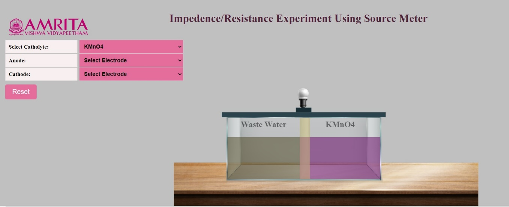
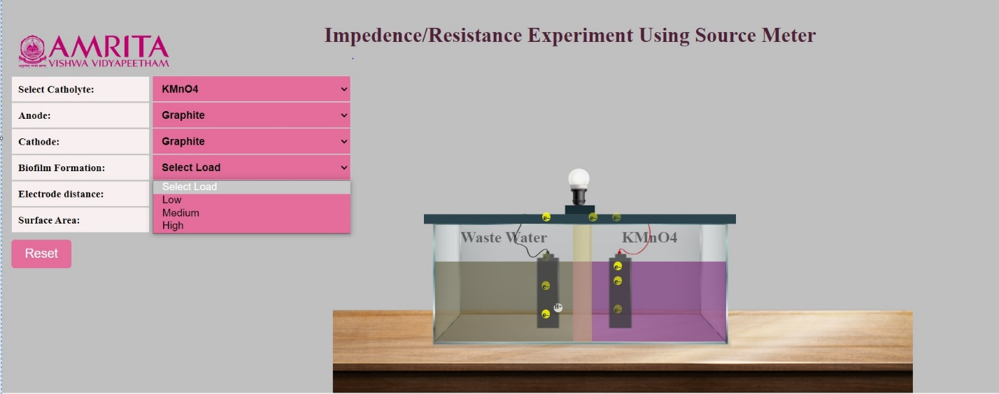
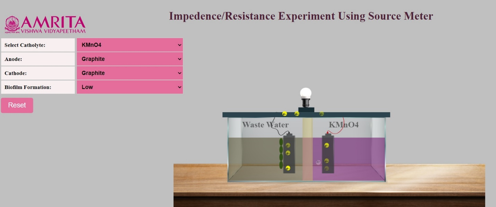
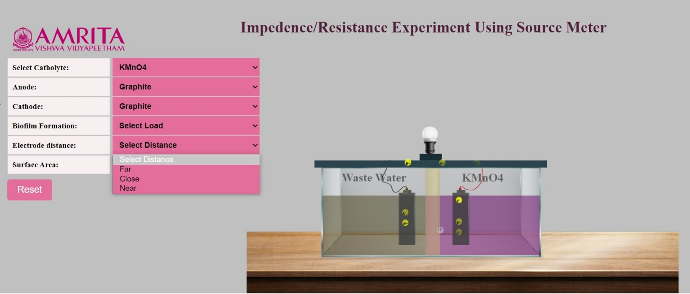
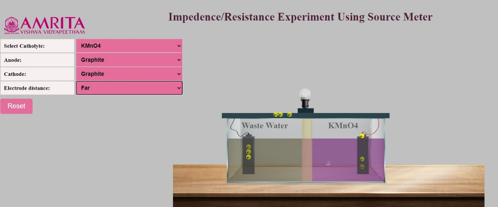
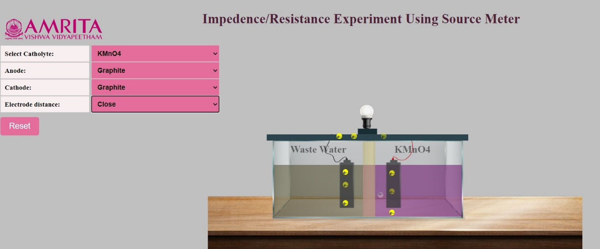
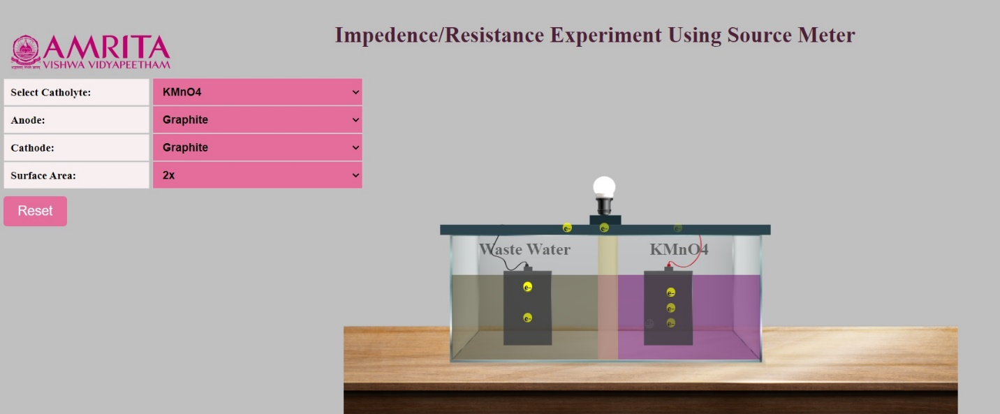
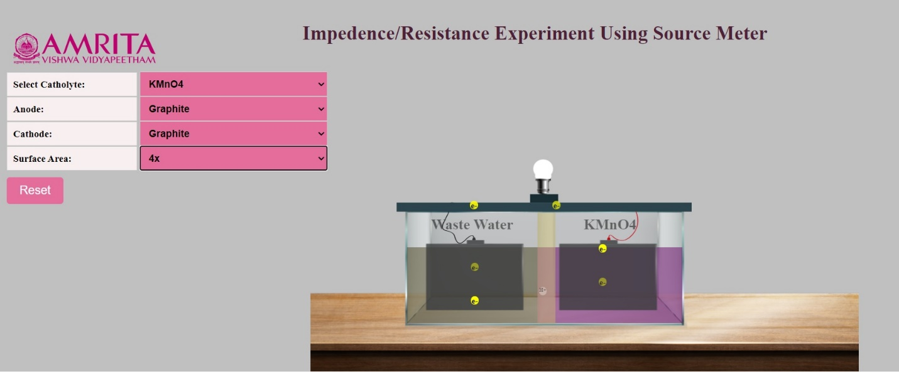

### Procedure

1. Users can open the simulator window. In the GUI, options to select Catholyte are provided. Users can either choose KMO4 or Water as the Catholyte. The anodic chamber is already filled with wastewater as anolyte. 

&nbsp;

2.	Here, KMO4 is selected as Catholyte the cathodic chamber gets filled with KMO4 solution. When Catholyte is selected, users can now see options to select anode and cathode.
      

&nbsp;

3.	The options for anode and cathode provided are graphite and the users can select that as input for electrode selection. When electrodes are selected, the MFC starts working and users can see the movement of electrons to the external circuit resulting in the production of bioelectricity which was shown as a glow to the bulb attached to the MFC. The H+ ions cross the proton exchange membrane and move to the cathodic chamber. Also, the electrons move to the cathodic chamber and redox reactions occur at the cathodic chamber. 
To study the factors contributing to impedance to the MFC output, three parameters are provided: Biofilm Formation. Electrode Distance and Surface Area. Users can choose any of these parameters and can learn how each factor affects the output of the MFC. 

&nbsp;

#### Biofilm Formation

4.	Here Biofilm Formation is selected as the parameter to study how it contributes to impedance to the system. Biofilm formation ranges were provided as Low, Medium, and High.

&nbsp;

5.	When the biofilm formation range is selected as low, a thin biofilm formation on the anode surface is denoted as green rods of bacteria attached to the electrode. Upon selection, users can see the transfer of electrons to the external circuit to produce bioelectricity and protons also move to the cathodic chamber through PEM without any resistance. 

&nbsp;

6.	When the biofilm formation range is selected as a medium, a thick biofilm is formed on the anode electrode. Users can see the transfer of electrons to the external circuit to produce bioelectricity and protons also move to the cathodic chamber through PEM, but the rate of transfer is reduced when compared to the low level of biofilm formation. This indicates that internal resistance is created due to the biofilm formation.

&nbsp;

7.	When the biofilm formation range is selected as high, a thicker biofilm is formed on the anode electrode. Users can see the transfer of electrons to the external circuit to produce bioelectricity and protons also move to the cathodic chamber through PEM, but the rate of transfer is very low compared to the low and medium level of biofilm formation. The reduction in the electron transfer is indicated by the lesser glow of the electric bulb attached to the system. This indicates that a higher internal resistance is created due to the thick biofilm formation. 
The results indicate that biofilm formation can cause internal resistance called impedance reducing the overall efficiency of the microbial fuel cell. The thicker the biofilm formation, the lower the efficiency of the MFC. 

8.	Users can click on the reset button to restart the experiment and can then select the other parameters contributing impedance to MFC. 

#### Electrode Distance

9.	Here electrode distance is selected as the parameter to study how it contributes to impedance to the system. Electrode distance ranges were provided as far, close, and near.

&nbsp;

10.	When electrode distance is selected as far, users can observe that both the anode and cathode get placed at a longer distance. Users can see the transfer of electrons to the external circuit to produce bioelectricity and protons also move to the cathodic chamber through PEM, but the movement rate is very slow. 

&nbsp;

11.	When electrode distance is selected as close, users can observe that both the anode and cathode get placed closer to each other. Users can see the transfer of electrons to the external circuit to produce bioelectricity and protons also move to the cathodic chamber through PEM, the movement rate is higher when compared to the electrodes placed at a longer distance. This indicates there is some internal resistance when the electrodes are placed closer to each other resulting in lower power efficiency of the system.
 

&nbsp;

12.	When electrode distance is selected as near, users can observe that both the anode and cathode get placed closer to the PEM. Users can see the transfer of electrons to the external circuit to produce bioelectricity and protons also move to the cathodic chamber through PEM, at a faster rate. This indicates that the internal resistance is getting reduced with a reduction in the electrode distance contributing to higher efficiency of the MFC. 
The results indicate that electrode distance is a possible factor for impedance affecting the overall efficiency of the microbial fuel cell. The longer distance of the electrode positions the higher the internal resistance and lower the efficiency of the MFC. 

13.	Users can click on the reset button to re-start the experiment and can then select the other parameter contributing impedance to MFC

#### Surface Area 

14.	Here surface area of the electrode is selected as the parameter to study how it contributes to impedance to the system. The surface area is provided as 1X, 2X, and 4X.

&nbsp;

15.	When the surface area of the electrode is selected as 1X, users can see the transfer of electrons to the external circuit to produce bioelectricity and protons also move to the cathodic chamber through PEM, but the movement rate is very slow. This contributes to low current production.

&nbsp;

16.	When the surface area of the electrode is selected as 2X, users can see the thickness of the electrodes is increased (doubles). Users can observe the transfer of electrons to the external circuit to produce bioelectricity and the movement of protons to the cathodic chamber through PEM, the movement rate is higher compared to the 1X electrode. 

&nbsp;

17.	When the surface area of the electrode is selected as 4X, users can see thick graphite electrodes as anode and cathode. Users can observe the transfer of electrons to the external circuit to produce bioelectricity and the movement of protons to the cathodic chamber through PEM at a faster rate when compared to 1X and 2X electrodes. 

&nbsp;

The results indicate that the surface area of the selected electrodes is important for determining the efficiency of the MFC. The greater surface area of the electrodes will result in lower impedance and higher efficiency of the MFC. 

18.	In all the cases, the production of bioelectricity can be observed by the glow of the electric bulb and the dim light indicates low production of electricity. A source meter can be connected to measure the output voltage and current of the MFC. 

19.	Users can click on the reset button to restart the experiment simulator. 
From the experiment, it is observed that the thicker biofilm formation by the microorganisms in the substrate, longer distance of the electrode position, and lower surface area of the electrodes are the design parameters that contribute to impedance and resultant lower power efficiency of the MFC. These factors need to be considered while constructing MFC at a laboratory scale to improve its efficiency. 

