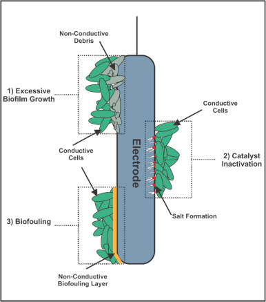

### Introduction

Microbial fuel cells (MFCs) are alternative energy sources that convert chemical energy in the organic matter present in wastewater into electrical energy. This technology has been of particular interest in the last few decades and significant efforts have been made to intensify the commercialization of MFC technology. It has been noted that the power output of MFCs in laboratory settings is very low making it insignificant for practical applications and large-scale production and utilization of electric current. This is due to the high internal resistance of MFCs, which needs to be addressed to enhance the utility of MFCs. This highlighted the need for the optimization of the construction factors of MFCs that could reduce impedance or resistance in MFCs thereby improving the electrochemical behavior and overall performance and efficiency of the MFC in a laboratory setting.

### Theory

In a microbial fuel cell, impedance or resistance indicates the opposition to the flow of electrical current through the components of the cell.  The characteristics of impedance or resistance in an MFC evaluate its electrochemical behavior, performance, and overall efficiency of the system. Minimizing the impedance or resistance within the MFC is the only way to improve the power output of the system and the resulting power could be used for various applications including wastewater treatment, biosensing, and other environmental and energy-related applications. For the commercialization of MFC at a large scale, the performance needs to be enhanced at a significant level. Selecting proper MFC components and optimizing the physical and chemical parameters boost the efficiency of MFCs and subsequently reduce the manufacturing cost. The power output of the MFC depends directly on the selection of electrode and its size, biocatalysts, pH and ionic concentration of anolyte and catholyte, characteristics of electron donor and electron acceptors, the temperature of the system, and so on that that reduces the internal resistance and increases the columbic efficiency. 

This experiment highlights the design parameters of the MFC to improve the performance of the MFC in a laboratory setting.

### Design of a Microbial Fuel Cell

A typical MFC consists of anodic and cathodic compartments separated by a cation (positively charged ion) specific membrane (Fig.1). The microorganisms in the anodic compartment of MFCs are exoelectrogenic in nature and generate electrons, protons, carbon dioxide, and other metabolic products by metabolizing organic matter. The electrons are transferred externally to the cathodic chamber with simultaneous production of electricity. The generated protons in the anodic compartment are transported to the cathodic chamber through the proton exchange membrane, and the protons and electrons in the cathodic chamber combine with oxygen to produce water molecules. This redox reaction completes the electron transfer cycle, and the generated electricity can be used for sensors or working any small electronic devices. 

&nbsp;

Fig.1. Design of a microbial fuel cell

Adapted from: Apollon, W., 2023. An Overview of Microbial Fuel Cell Technology for Sustainable Electricity Production. Membranes, 13(11), p.884.

#### Factors contributing to impedance or resistance in an MFC

Some key factors contribute to impedance in an MFC. It is crucial to optimize those factors during the design and construction of MFC to improve its performance and power generation efficiency.  Exoelectricigens present in the anodic chamber are important for MFC performance due to their metabolic properties and the mediators that are used by them for transferring electrons to the anode. While design considerations, operating conditions such as pH, temperature, ionic strength of the mediums, material, and construction of the anode, cathode, and proton exchange membrane could have a considerable impact on the bioelectricity generation.

##### 1.	Electrode Material and Geometry

The choice of electrode material and its geometry has a crucial role in determining the power generation, efficiency, and long-term stability of the MFC. The electrode materials should possess higher electrical conductivity that facilitates the efficient transfer of electrons between the microbial biofilm and the electrode surface. The commonly used electrodes in the MFC are graphite, carbon cloth, and carbon nanotubes owing to their high conductivity. Electrodes modified with catalysts platinum or other noble metals, can boost the redox reactions and improve MFC performance. The surface area of the electrodes is a significant contributor to power efficiency in a MFC. The higher surface area of the electrode materials (electrodes with higher surface-to-volume ratios) contributes to more active sites for the attachment of microorganisms to form biofilm resulting in increased microbial activity and electron transfer efficiency. Also, the electrode material must possess chemical stability by resisting corrosion by the electrolytes and microbial metabolites to ensure long-term stability and overall improvement in MFC performance. 

##### 2.	Spacing of Electrodes

The spacing between the electrodes in an MFC contributes to the overall performance of the MFC. The distance between the cathode and anode determines the efficiency of electron transfer within the MFC. When electrons are generated in the anodic chamber by microbial metabolism, the minimal distance between the anode and cathode ensures the transfer of electrons from the anode to the cathode and favors the reduction reaction. The larger the distance between the electrodes, the larger the distance over which the electrons and H+ ions must move to the cathodic compartment leading to higher internal resistance and lower power output. There will be higher ohmic losses with the increase in electrode spacing reducing the overall efficiency of the MFC. The mass transport in the system is also altered with increased electrode distance by hindering the substrate metabolism and microbial activity followed by hindering the redox reaction and the performance of the MFC. Optimal spacing of electrodes is also important for promoting uniform biofilm growth for the electron transfer mechanism. 

##### 3.	Biofilm Formation

The formation of biofilm on the surface of electrodes is directly related to the impedance or resistance in a MFC (Fig.2). As the biofilm grows thicker on the anode surface, there will be limitations to the diffusion of substrates and other products involved in microbial metabolism in the anodic chamber. This limits the transport of electrons, protons, and nutrients to and fro to anode and cathode surface creating a higher impedance. The extracellular polymeric substances (EPS) in the biofilms obstruct the electron transfer pathways in the system.  That indicates that the thicker the biofilm the higher the resistance properties contributing to increased impedance in the MFC. The formation of biofilm in the electrode surface depends on the availability of the substrate, concentrations of the nutrients, and the operating condition of the bioreactor. Optimizing these conditions could prevent the formation of thick biofilm minimizing the impedance in the MFC. Over a while, biofilm sloughing can occur which exposes the anode surfaces and reduces the impedance. 

&nbsp;

Fig 2. Biofilm formation on the surface of the anode in the MFC

Adapted from: Slate, A.J., Whitehead, K.A., Brownson, D.A. and Banks, C.E., 2019. Microbial fuel cells: An overview of current technology. Renewable and sustainable energy reviews, 101, pp.60-81.

Apart from these, the common operating condition that contributes to impedance in the MFC include the pH and ionic strength of the anolyte that can alter microbial metabolism, ion transport, and biofilm formation and higher temperatures leading to enhanced microbial activity and an increase in electrolyte resistance, thus affecting impedance.

The source meter can measure both voltage and current produced by the MFC to determine the performance and efficiency of the MFC system in a laboratory setting. 

